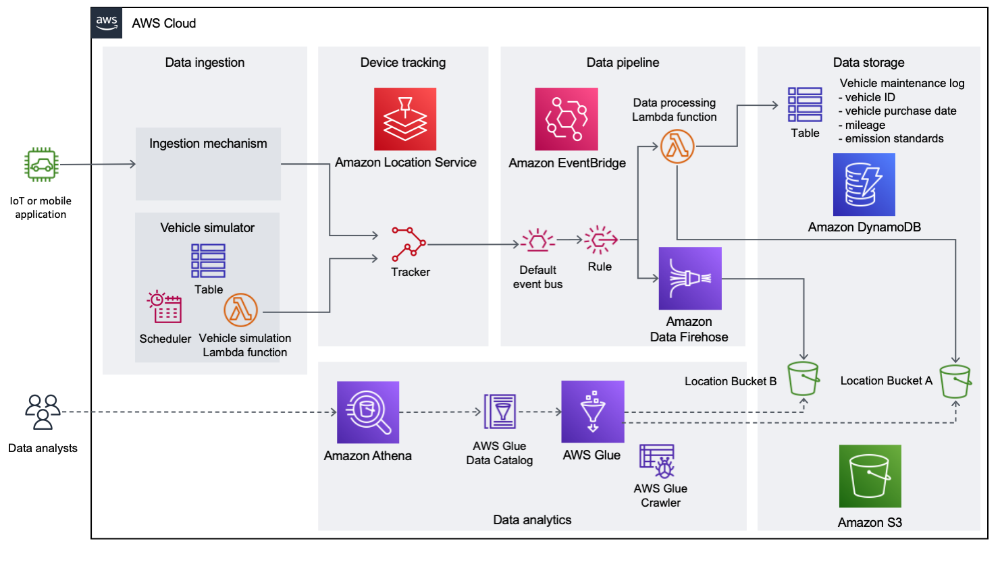
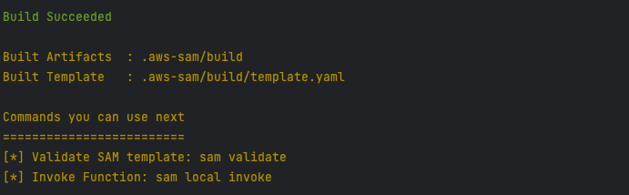
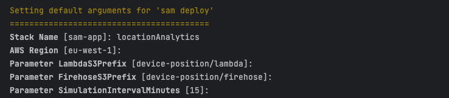
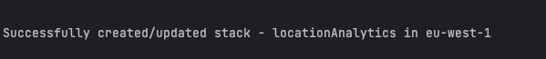

# Gain insights from historical location data using Amazon Location Service and AWS analytics services #

## Overview ##

Many organizations around the world rely on the use of physical assets, such as vehicles, to deliver a service to their end-customers. By tracking these assets in real time and storing the results, asset owners can derive valuable insights on how their assets are being used to continuously deliver business improvements and plan for future changes. For example, a delivery company operating a fleet of vehicles may need to ascertain the impact from local policy changes outside of their control, such as the announced expansion of an [Ultra-Low Emission Zone (ULEZ)](https://en.wikipedia.org/wiki/Ultra_Low_Emission_Zone). By combining historical vehicle location data with information from other sources, the company can devise empirical approaches for better decision-making. For example, the company’s procurement team can use this information to make decisions about which vehicles to prioritize for replacement before policy changes go into effect.

Developers can use the support in [Amazon Location Service](https://aws.amazon.com/location/) for [publishing device position updates to Amazon EventBridge](https://aws.amazon.com/about-aws/whats-new/2023/07/amazon-location-service-device-updates-eventbridge/) to build a near-real-time data pipeline that stores locations of tracked assets in [Amazon Simple Storage Service (Amazon S3)](https://aws.amazon.com/s3/). Additionally, you can use [AWS Lambda](https://aws.amazon.com/lambda/) to enrich incoming location data with data from other sources, such as an [Amazon DynamoDB](https://aws.amazon.com/dynamodb/) table containing vehicle maintenance details. Then a data analyst can use the [geospatial querying capabilities](https://docs.aws.amazon.com/athena/latest/ug/querying-geospatial-data.html) of [Amazon Athena](https://aws.amazon.com/athena/) to gain insights, such as the number of days their vehicles have operated in the proposed boundaries of an expanded ULEZ. Because vehicles that do not meet ULEZ emissions standards are subjected to a daily charge to operate within the zone, you can use the location data, along with maintenance data such as age of the vehicle, current mileage, and current emissions standards to estimate the amount the company would have to spend on daily fees.

This post shows how you can use Amazon Location, EventBridge, Lambda, [Amazon Data Firehose](https://aws.amazon.com/kinesis/data-firehose/), and Amazon S3 to build a location-aware data pipeline, and use this data to drive meaningful insights using [AWS Glue](https://aws.amazon.com/glue/) and Athena.



## AWS Blog post ##

This approach is documented in the following AWS blog post:

[Gain insights from historical location data using Amazon Location Service and AWS analytics services](https://aws.amazon.com/blogs/big-data/gain-insights-from-historical-location-data-using-amazon-location-service-and-aws-analytics-services/)

## Walkthrough ##

### Prerequisites ###

For this walkthrough, you will need the following prerequisites in place:

* An AWS account
* [AWS Identity and Access Management (IAM)](https://aws.amazon.com/iam/) permissions to deploy the AWS resources using [AWS Serverless Application Model (AWS SAM)](https://aws.amazon.com/serverless/sam/)
* Local installation of the latest version of [AWS SAM Command Line Interface (CLI)](https://docs.aws.amazon.com/serverless-application-model/latest/developerguide/install-sam-cli.html)
* Local installation of [Python 3.11](https://www.python.org/downloads/release/python-3110/) and [pip](https://pypi.org/project/pip/)

### Deploying the solution ###

* Follow the steps in the [official documentation](https://docs.aws.amazon.com/serverless-application-model/latest/developerguide/install-sam-cli.html) to install the latest release of the AWS SAM CLI for your operating system
* Once successfully installed, run `sam --version` to return the AWS SAM CLI version

> Note: The AWS SAM CLI requires appropriate permissions to provision resources in the chosen AWS account. Ensure that [access key and secret access keys](https://docs.aws.amazon.com/serverless-application-model/latest/developerguide/prerequisites.html) have been created using IAM, and that aws configure has been used to register them locally on your machine.

1. To download all required files to your local machine, run the following command.

```
git clone https://github.com/aws-samples/amazon-location-service-data-analytics
```

2. Navigate to the `sam` directory.

```
cd sam
```

3. Build the SAM application. 

```
sam build
```

4. Confirm that the `Build Succeeded` message is displayed.



5. Deploy the application.

```
sam deploy --guided
```

6. When prompted, enter the unique details chosen for your environment. In this example, we have chosen the CloudFormation stack name `locationAnalytics` and kept the remainder of the options as defaults. CloudFormation parameter `SimulationIntervalMinutes` is the frequency with which simulated device location updates take place (by default, this is every 15 minutes).

```
Stack Name []:locationAnalytics
AWS Region [eu-west-1]:
Parameter LambdaS3Prefix [device-position/lambda]:
Parameter FirehoseS3Prefix [device-position/firehose]:
Parameter SimulationIntervalMinutes [15]:
```

Deployment options are explained below:

| Options                              | Explanation                                                                                                                                                                                                                  | Default                        | Further information                                                                                                                              |
|--------------------------------------|------------------------------------------------------------------------------------------------------------------------------------------------------------------------------------------------------------------------------|--------------------------------|--------------------------------------------------------------------------------------------------------------------------------------------------|
| Stack Name                           | The name of the AWS CloudFormation stack that you are deploying to. If you specify an existing stack, then the command updates the stack. If you specify a new stack, then the command creates it.                           |                                | [AWS SAM CLI reference](https://docs.aws.amazon.com/serverless-application-model/latest/developerguide/sam-cli-command-reference-sam-deploy.html) |
| AWS Region                           | The AWS Region to deploy to. For example, `eu-west-1`.                                                                                                                                                                       | Current region set in AWS CLI. | [AWS SAM CLI reference](https://docs.aws.amazon.com/serverless-application-model/latest/developerguide/sam-cli-command-reference-sam-deploy.html) |
| Parameter `LambdaS3Prefix`           | The S3 bucket prefix under which location data objects for the Lambda pattern will be stored.                                                                                                                                | `device-position/lambda`       |                                                                                                                                                  |
| Parameter `FirehoseS3Prefix`         | The S3 bucket prefix under which location data objects for the Firehose pattern will be stored.                                                                                                                              | `device-position/firehose`     |                                                                                                                                                  |
| Parameter `SimulationIntervalMinutes` | Number of minutes between executions of the device simulation function.                                                                                                                                                      | `15`                           |                                                                                                                                                  |
| Confirm changes before deploy [y/N]  | Configures the AWS SAM CLI to display your AWS CloudFormation change set and ask for confirmation before deploying.                                                                                                          | `N`                            | [AWS sam deploy reference](https://docs.aws.amazon.com/serverless-application-model/latest/developerguide/using-sam-cli-deploy.html)             |
| Allow SAM CLI IAM role creation [Y/n] | Allows AWS SAM to create the IAM roles necessary for the solution.                                                                                                                                                           | `Y`                            | [AWS sam deploy reference](https://docs.aws.amazon.com/serverless-application-model/latest/developerguide/using-sam-cli-deploy.html)             |
| Disable rollback [y/N] | Specifies whether to roll back your AWS CloudFormation stack if an error occurs during a deployment. By default, if there's an error during a deployment, your AWS CloudFormation stack rolls back to the last stable state. | `N`                            | [AWS sam deploy reference](https://docs.aws.amazon.com/serverless-application-model/latest/developerguide/sam-cli-command-reference-sam-deploy.html) |
| Save arguments to configuration file [Y/n] | Saves the parameters that you provide at the command line to the AWS SAM configuration file.                                                                                                                                 | `Y`                            | [AWS sam deploy reference](https://docs.aws.amazon.com/serverless-application-model/latest/developerguide/sam-cli-command-reference-sam-deploy.html) |
| SAM configuration file [samconfig.toml] | The path and file name of the configuration file containing default parameter values to use. The default value is `samconfig.toml` in the root of the project directory.                                                     | `samconfig.toml`               | [AWS sam deploy reference](https://docs.aws.amazon.com/serverless-application-model/latest/developerguide/sam-cli-command-reference-sam-deploy.html) |
| SAM configuration environment [default] | The environment name specifying the default parameter values in the configuration file to use. The default value is `default`.                                                                                               | `default`                      | [AWS sam deploy reference](https://docs.aws.amazon.com/serverless-application-model/latest/developerguide/sam-cli-command-reference-sam-deploy.html) |



7. Confirm that the `Successfully created/updated stack` message is shown. Deployment will take approximately 5 minutes.



8. You are now ready to test the solution.

### Cleaning up ###
To avoid incurring future charges, delete the CloudFormation stacks that have been provisioned in the AWS account. This can be achieved using:

```
sam delete
```

You will be required to empty the S3 bucket before the template can be deleted. The S3 bucket used for location data can be found in the CloudFormation output `LocationDataS3Bucket`.
